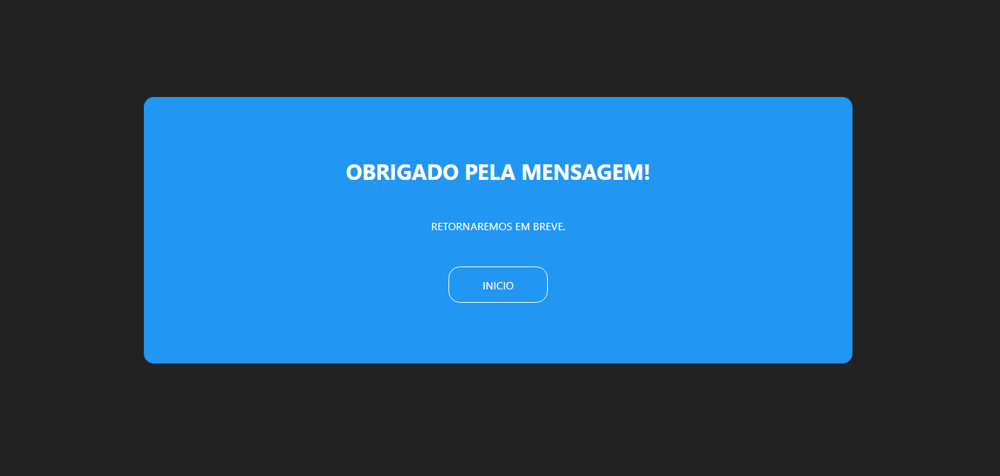

# Página de Agradecimento

> Resultado do projeto Página de Agradecimento.

### Ajustes e melhorias

O projeto trata-se de uma página de agradecimento que está vinculada ao portifolio, foram usadas:

- [x] Criação do HTML
- [x] Criação do CSS
- [x] Responsividade

## 🤝 Colaboradores

Agradecemos 맙 seguintes pessoas que contribu칤ram para este projeto:

<table>
  <tr>
    <td align="center">
      <a href="#">
         
        
          <b>Vagner Santos</b>
        
      </a>
    </td>
  </tr>
</table>

